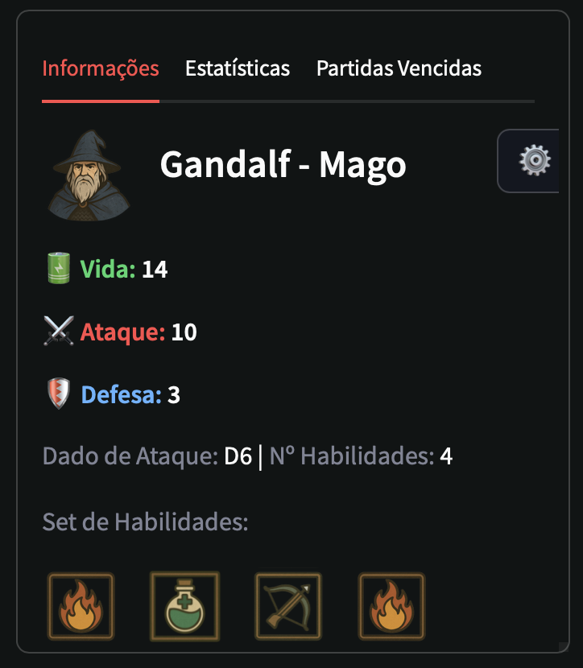
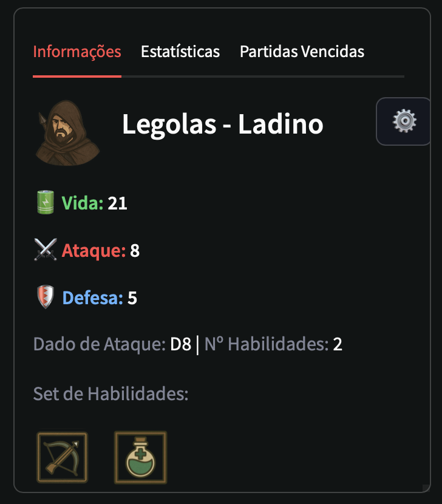
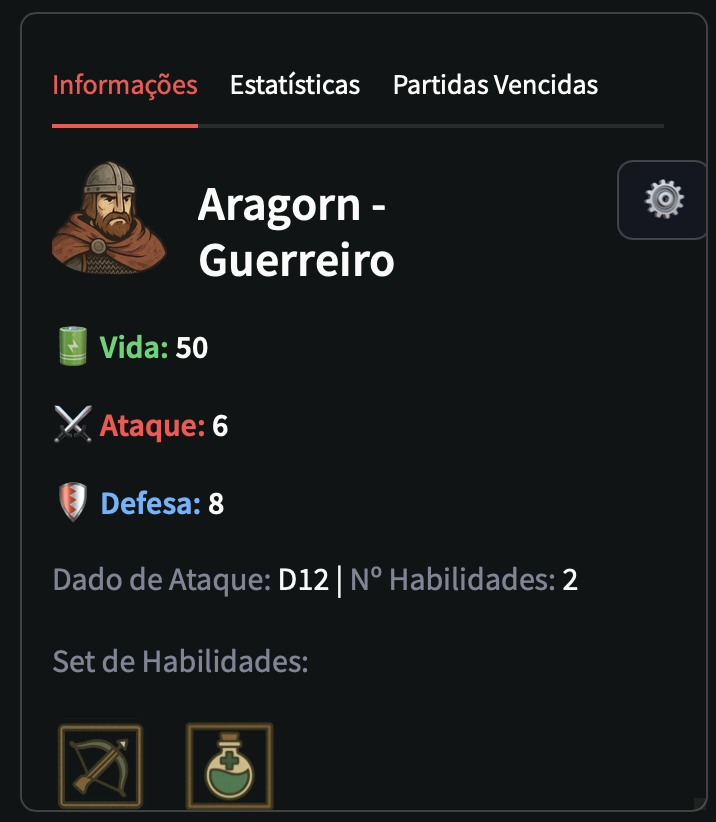
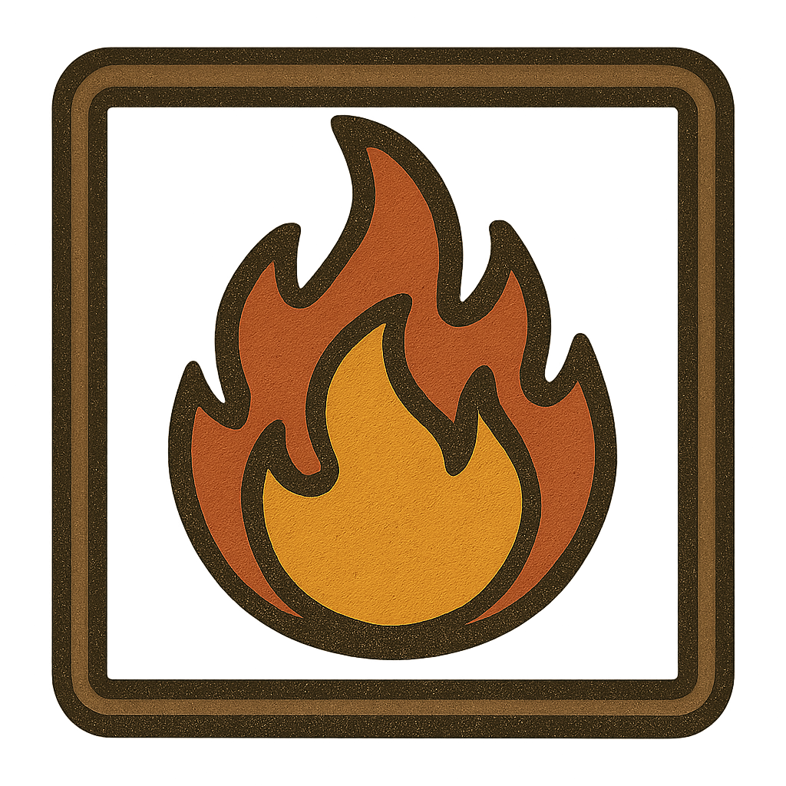
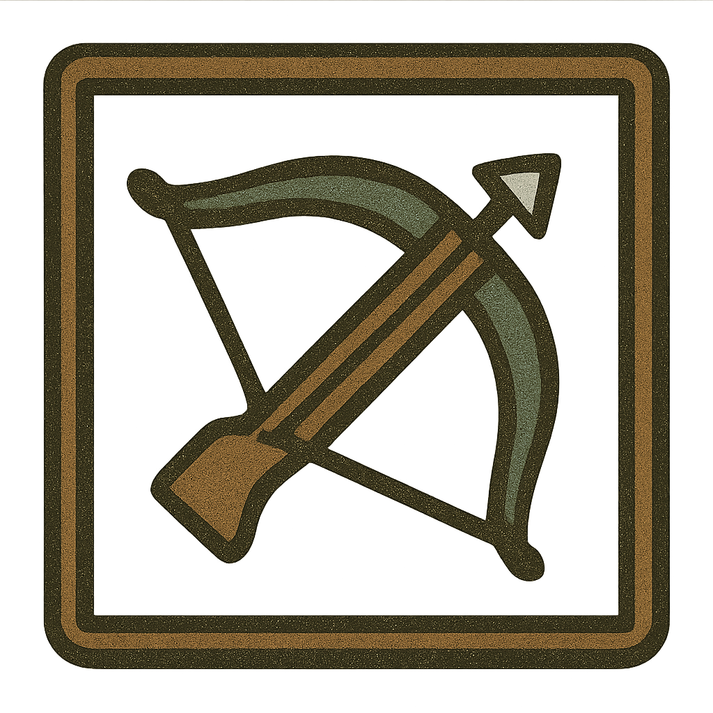
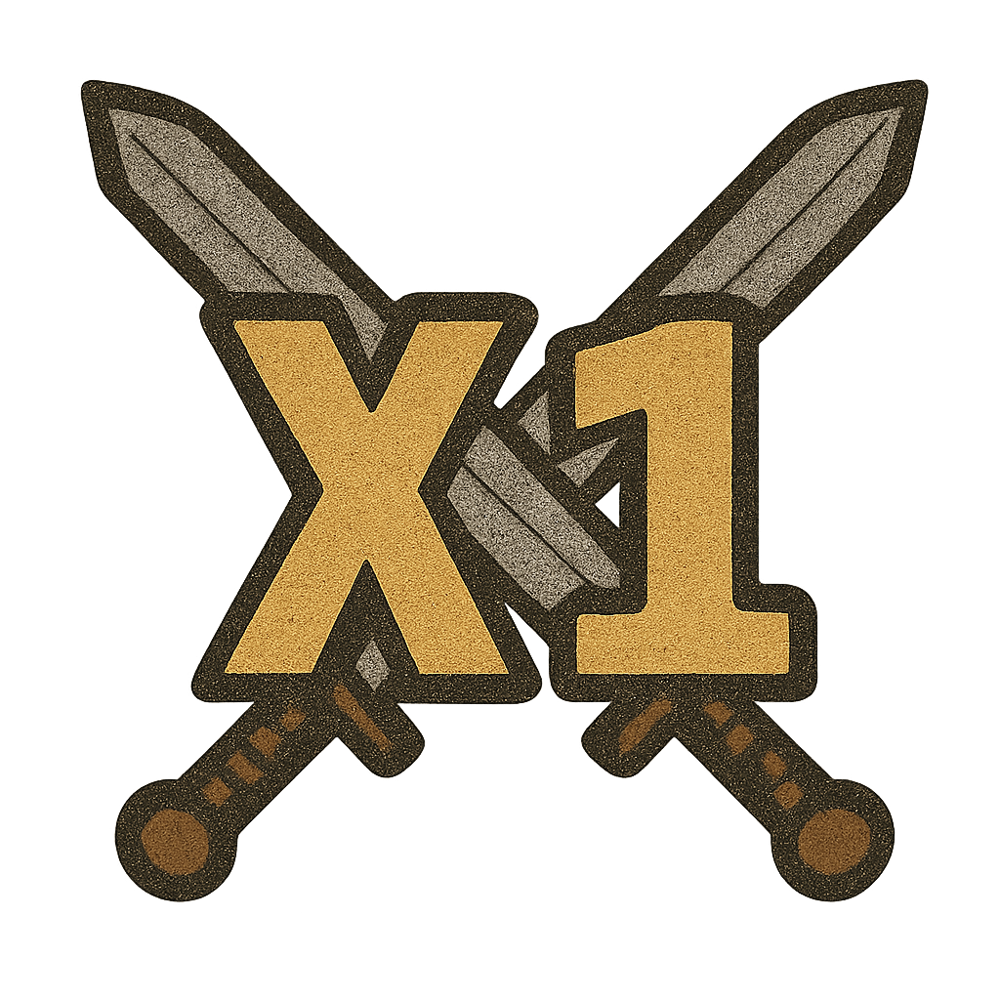
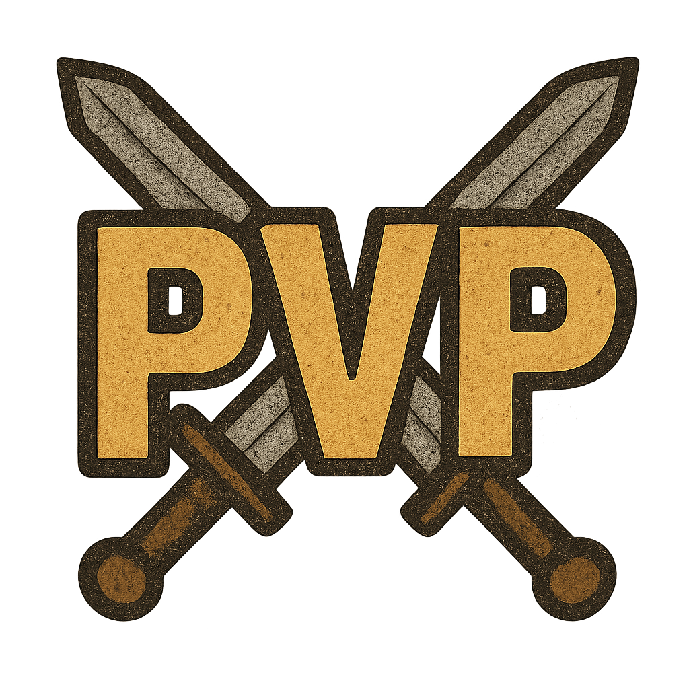
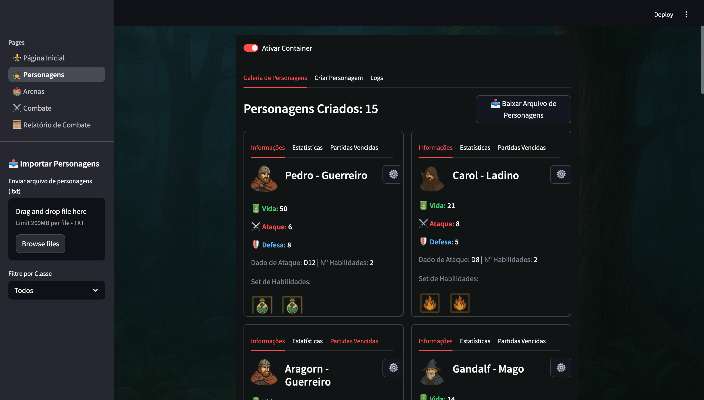
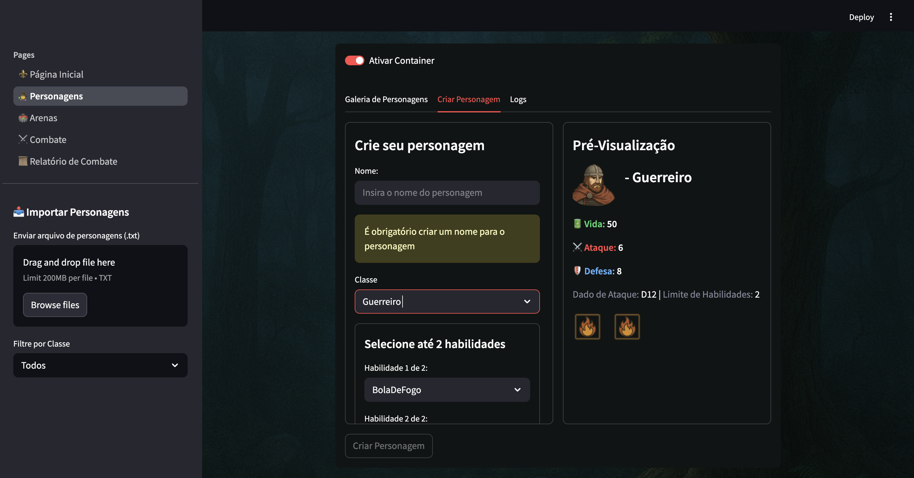

# 🧙‍♂️ Sistema de RPG em Python


Projeto desenvolvido para a disciplina **Programação Orientada à Dados** (POD) com o objetivo de aplicar os conceitos de orientação a objetos em um sistema de RPG interativo com interface em Streamlit.

---

## 1️⃣ Personagens, Classes, Habilidades e Mapas

### 🧍 Personagens
Os personagens representam os jogadores. Cada personagem é instanciado a partir de um arquivo de configuração ou via interface e está vinculado a uma **classe** (como Mago, Guerreiro ou Ladino) e um conjunto de **habilidades**.

Atributos importantes:
- Nome
- Classe
- Vida, Ataque, Defesa
- Inventário de habilidades


### 🏹 Classes
As classes definem o estilo de jogo do personagem, com valores distintos de vida, ataque, defesa e limite de habilidades. Cada classe também utiliza um tipo diferente de dado para calcular o dano de ataque.
- `Guerreiro`: alta defesa e vida
- `Mago`: alto ataque e muitas habilidades
- `Ladino`: equilibrado

| Classe    | Vida                     | Ataque | Defesa | Dado de Ataque | Limite de Habilidades |
|-----------|--------------------------|--------|--------|----------------|------------------------|
| Guerreiro | 10 + (8 × 5) = **50**    | 6      | 8      | D12            | 2                      |
| Mago      | 8 + (3 × 2) = **14**     | 10     | 3      | D6             | 5                      |
| Ladino    | 6 + (5 × 3) = **21**     | 8      | 5      | D8             | 2                      |


<p align="center">
  
  
  
</p>
As classes utilizam diferentes tipos de dados para ataque (`D12`, `D6`, `D8`, etc.).
### ✨ Habilidades
As habilidades são poderes únicos usados pelos personagens durante o combate. Algumas habilidades causam dano, outras curam.

Exemplos:
- `Bola De Fogo`: dano de 10
- `Tiro De Arco`: dano de 6
- `Cura`: restaura 10 de vida

<p align="center">
  
  
  
</p>
#


### 🗺️ Mapas
O sistema inclui diferentes **arenas de combate**, carregadas de um arquivo ou criadas via interface. Cada arena define o ambiente onde ocorrem os combates.

Mapas:
- `Vilarejo`
- `Torre`

Tipo de jogo:
<p align="center">
  
  
</p>


---

## 2️⃣ Páginas da Aplicação

A interface foi desenvolvida com Streamlit, dividida nas seguintes páginas, organizadas na pasta `pages/`:

### 🏠 Página Inicial (`inicial.py`)
- Introdução ao sistema
- Navegação para outras seções

### 🧍‍♀️ Página de Personagens (`personagens.py`)
- Exibição dos personagens disponíveis
- Detalhes de atributos, classe e habilidades
- Estatísticas de combate, partidas vencidas
- Exclusão e edição de personagens




- Criação de personagens
- Pré-Visualização
- Seleção de classe e habilidades


### 🏟️ Página de Arena (`arenas.py`)
- Escolha da arena de combate
- Gerenciamento dos personagens em combate
- Criação e exclusão de personagens
- Estatísticas da arena

### ⚔️ Página de Combate (`combate.py`)
- Simulação de combates (duelo ou Free For All)
- Geração de logs e relatórios

### 📄 Página de Relatórios (`relatorio_combate.py`)
- Visualização do histórico de combates
- Leitura dos arquivos `logs_arena.txt` e `historico_combate.txt`

---

## 3️⃣ Estrutura do Projeto

```
📦 ProjetoRPG
├── RPG/                     # Pacote principal com as regras do jogo
│   ├── Arena.py             # Lógica de combate
│   ├── Classe.py            # Definições das classes de personagem
│   ├── Dados.py             # Subclasses de dados (D6, D8, D20, etc.)
│   ├── Habilidade.py        # Definições e subclasses de habilidades
│   ├── LogCombate.py        # Registro de logs de batalha
│   ├── Mapa.py              # Definições de arenas/mapas
│   ├── Partida.py           # Controle de partidas e estado da arena
│   ├── Personagem.py        # Definições dos personagens
│   ├── TipoJogo.py          # Tipos de combate (duelo ou múltiplos)
│   └── __init__.py
├── app.py                   # Arquivo principal (executa a aplicação)
├── assets/                  # Imagens e mídias para a interface
│   └── images/
├── data/                    # Dados de entrada e saída do sistema
│   ├── personagens.txt
│   ├── arenas.txt
│   ├── logs_personagem.txt
│   ├── logs_arena.txt
│   ├── historico_combate.txt
│   └── historico_batalhas.csv
├── pages/                   # Páginas do Streamlit
│   ├── inicial.py
│   ├── personagens.py
│   ├── arenas.py
│   ├── combate.py
│   └── relatorio_combate.py
├── utils/                   # Funções auxiliares
│   ├── caminhos.py
│   ├── exportacao.py
│   ├── gerenciamento/
│   ├── logs.py
│   ├── streamlit_utils.py
│   └── visual.py
```

---

## ▶️ Como Executar

1. Instale as dependências:
```bash
pip install streamlit
```

2. Execute o app:
```bash
streamlit run app.py
```